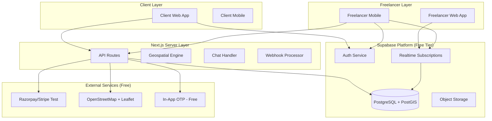
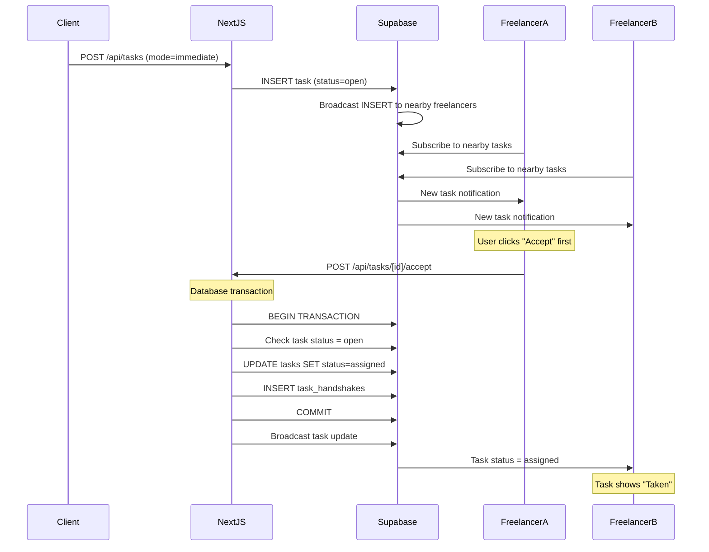
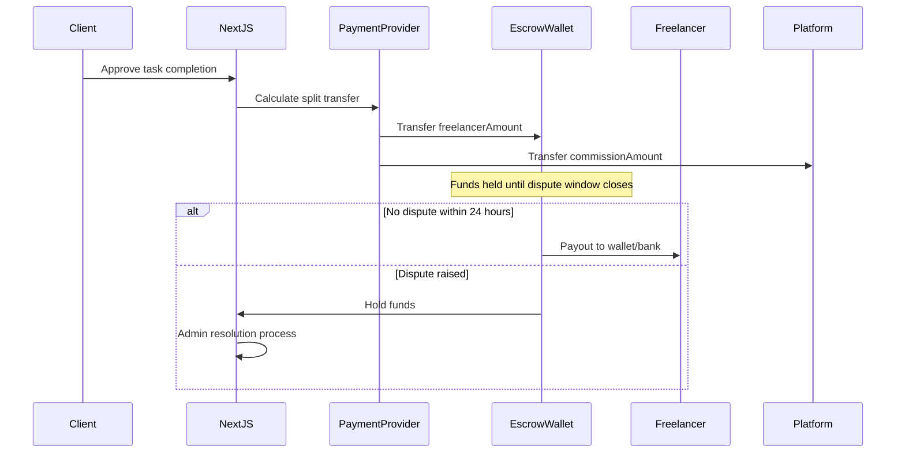

# TalentFlow v1.0 - Technical Architecture & Implementation Plan

**Version:** 1.0  
**Status:** Draft  
**Tech Stack:** Next.js 14 (App Router), TypeScript, Tailwind CSS, Supabase

---

## 1. System Overview

### 1.1 Concept
A **Location-First Gig Platform** connecting clients with verified student freelancers within a 5km radius. Two distinct workflows:
- **Mode A (Immediate):** First-come-first-served, broadcast to nearby freelancers
- **Mode B (Standard):** Traditional proposal/bidding model

### 1.2 Key Metrics
- **Search Radius:** 5km (5000 meters)
- **Commission Rates:** 10% (Verified) / 50% (Unverified)
- **Categories:** 7 hardcoded categories
- **Urgency Focus:** Real-time task matching for physical tasks

---

## 2. Architecture Diagram



---

## 3. Database Schema (PostgreSQL + PostGIS)

### 3.1 Extensions Required
```sql
-- Enable PostGIS for geospatial queries
CREATE EXTENSION IF NOT EXISTS postgis;

-- Enable UUID for unique identifiers
CREATE EXTENSION IF NOT EXISTS "uuid-ossp";
```

### 3.2 Core Tables

#### `profiles`
Stores user data with verification status and location.

```sql
CREATE TABLE profiles (
    id UUID PRIMARY KEY DEFAULT uuid_generate_v4(),
    user_id UUID REFERENCES auth.users(id) ON DELETE CASCADE,
    email TEXT NOT NULL,
    role TEXT NOT NULL CHECK (role IN ('client', 'freelancer')),
    
    -- Verification fields
    verification_status TEXT NOT NULL DEFAULT 'none' 
        CHECK (verification_status IN ('none', 'pending', 'verified')),
    college_id_url TEXT,
    gov_id_url TEXT,
    aadhaar_last_four TEXT,
    
    -- Commission rate (50% unverified, 10% verified)
    commission_rate INTEGER NOT NULL DEFAULT 50,
    
    -- Location (PostGIS geography point)
    location GEOGRAPHY(POINT, 4326),
    last_location_update TIMESTAMP WITH TIME ZONE,
    
    -- Gear list for content creators
    gear_list JSONB DEFAULT '[]',
    
    -- Stats
    completed_tasks INTEGER DEFAULT 0,
    average_rating DECIMAL(3, 2) DEFAULT 0,
    
    -- Timestamps
    created_at TIMESTAMP WITH TIME ZONE DEFAULT NOW(),
    updated_at TIMESTAMP WITH TIME ZONE DEFAULT NOW()
);

-- Index for geospatial queries
CREATE INDEX idx_profiles_location ON profiles USING GIST(location);

-- Index for verification status
CREATE INDEX idx_profiles_verification ON profiles(verification_status);
```

#### `tasks`
Core task table with mode and category support.

```sql
CREATE TYPE task_mode AS ENUM ('immediate', 'standard');
CREATE TYPE task_category AS ENUM (
    'content_engine',
    'hyper_local_logistics',
    'tech_neighbor',
    'academic_support',
    'event_support',
    'ai_training',
    'digital_assistant'
);
CREATE TYPE task_status AS ENUM (
    'open',
    'assigned',
    'in_progress',
    'review',
    'completed',
    'disputed',
    'cancelled'
);

CREATE TABLE tasks (
    id UUID PRIMARY KEY DEFAULT uuid_generate_v4(),
    client_id UUID REFERENCES profiles(id) ON DELETE CASCADE,
    
    -- Task details
    title TEXT NOT NULL,
    description TEXT NOT NULL,
    mode task_mode NOT NULL,
    category task_category NOT NULL,
    
    -- Pricing
    budget DECIMAL(10, 2) NOT NULL,
    escrow_amount DECIMAL(10, 2),
    
    -- Location (PostGIS geography point)
    geo_location GEOGRAPHY(POINT, 4326),
    address_text TEXT,
    is_nearby BOOLEAN NOT NULL DEFAULT FALSE,
    
    -- Status
    status task_status NOT NULL DEFAULT 'open',
    
    -- Immediate mode specific
    acceptance_deadline TIMESTAMP WITH TIME ZONE,
    
    -- Creative mode specific
    portfolio_required BOOLEAN DEFAULT FALSE,
    revision_limit INTEGER DEFAULT 2,
    
    -- Timestamps
    created_at TIMESTAMP WITH TIME ZONE DEFAULT NOW(),
    updated_at TIMESTAMP WITH TIME ZONE DEFAULT NOW(),
    started_at TIMESTAMP WITH TIME ZONE,
    completed_at TIMESTAMP WITH TIME ZONE
);

-- Index for geospatial queries
CREATE INDEX idx_tasks_geo_location ON tasks USING GIST(geo_location);

-- Index for status queries
CREATE INDEX idx_tasks_status ON tasks(status);
CREATE INDEX idx_tasks_client ON tasks(client_id);
```

#### `task_handshakes`
Handles the first-accept locking mechanism for Mode A tasks.

```sql
CREATE TABLE task_handshakes (
    id UUID PRIMARY KEY DEFAULT uuid_generate_v4(),
    task_id UUID REFERENCES tasks(id) ON DELETE CASCADE,
    freelancer_id UUID REFERENCES profiles(id) ON DELETE CASCADE,
    
    -- Acceptance tracking
    accepted_at TIMESTAMP WITH TIME ZONE DEFAULT NOW(),
    is_cancelled BOOLEAN DEFAULT FALSE,
    cancelled_reason TEXT,
    
    UNIQUE(task_id, freelancer_id)
);

CREATE INDEX idx_task_handshakes_task ON task_handshakes(task_id);
CREATE INDEX idx_task_handshakes_freelancer ON task_handshakes(freelancer_id);
```

#### `task_applications`
For Mode B (Standard) task proposals.

```sql
CREATE TABLE task_applications (
    id UUID PRIMARY KEY DEFAULT uuid_generate_v4(),
    task_id UUID REFERENCES tasks(id) ON DELETE CASCADE,
    freelancer_id UUID REFERENCES profiles(id) ON DELETE CASCADE,
    
    -- Proposal details
    cover_letter TEXT NOT NULL,
    portfolio_links JSONB DEFAULT '[]',
    proposed_budget DECIMAL(10, 2),
    
    -- Status
    status TEXT NOT NULL DEFAULT 'pending' 
        CHECK (status IN ('pending', 'accepted', 'rejected', 'withdrawn')),
    
    -- Timestamps
    created_at TIMESTAMP WITH TIME ZONE DEFAULT NOW(),
    updated_at TIMESTAMP WITH TIME ZONE DEFAULT NOW()
);

CREATE INDEX idx_task_applications_task ON task_applications(task_id);
CREATE INDEX idx_task_applications_freelancer ON task_applications(freelancer_id);
```

#### `chats`
Real-time chat for task communication.

```sql
CREATE TABLE chats (
    id UUID PRIMARY KEY DEFAULT uuid_generate_v4(),
    task_id UUID REFERENCES tasks(id) ON DELETE CASCADE,
    
    created_at TIMESTAMP WITH TIME ZONE DEFAULT NOW(),
    updated_at TIMESTAMP WITH TIME ZONE DEFAULT NOW()
);

CREATE INDEX idx_chats_task ON chats(task_id);
```

#### `messages`
Individual messages with safety filtering.

```sql
CREATE TABLE messages (
    id UUID PRIMARY KEY DEFAULT uuid_generate_v4(),
    chat_id UUID REFERENCES chats(id) ON DELETE CASCADE,
    sender_id UUID REFERENCES profiles(id) ON DELETE CASCADE,
    
    content TEXT NOT NULL,
    message_type TEXT DEFAULT 'text' CHECK (message_type IN ('text', 'image', 'location', 'otp')),
    
    -- Safety flags
    safety_flagged BOOLEAN DEFAULT FALSE,
    safety_filtered_content TEXT,
    
    -- Timestamps
    created_at TIMESTAMP WITH TIME ZONE DEFAULT NOW()
);

CREATE INDEX idx_messages_chat ON messages(chat_id);
CREATE INDEX idx_messages_created ON messages(created_at);
```

#### `task_attachments`
For proof of work (photos, files).

```sql
CREATE TABLE task_attachments (
    id UUID PRIMARY KEY DEFAULT uuid_generate_v4(),
    task_id UUID REFERENCES tasks(id) ON DELETE CASCADE,
    uploaded_by UUID REFERENCES profiles(id) ON DELETE CASCADE,
    
    file_url TEXT NOT NULL,
    file_type TEXT,
    file_size INTEGER,
    
    is_proof_of_work BOOLEAN DEFAULT FALSE,
    
    created_at TIMESTAMP WITH TIME ZONE DEFAULT NOW()
);

CREATE INDEX idx_task_attachments_task ON task_attachments(task_id);
```

#### `reviews`
Task completion reviews.

```sql
CREATE TABLE reviews (
    id UUID PRIMARY KEY DEFAULT uuid_generate_v4(),
    task_id UUID REFERENCES tasks(id) ON DELETE CASCADE,
    reviewer_id UUID REFERENCES profiles(id) ON DELETE CASCADE,
    reviewee_id UUID REFERENCES profiles(id) ON DELETE CASCADE,
    
    rating INTEGER NOT NULL CHECK (rating >= 1 AND rating <= 5),
    comment TEXT,
    
    created_at TIMESTAMP WITH TIME ZONE DEFAULT NOW()
);

CREATE INDEX idx_reviews_task ON reviews(task_id);
CREATE INDEX idx_reviews_reviewee ON reviews(reviewee_id);
```

#### `sos_alerts`
Emergency alerts for active tasks.

```sql
CREATE TABLE sos_alerts (
    id UUID PRIMARY KEY DEFAULT uuid_generate_v4(),
    task_id UUID REFERENCES tasks(id) ON DELETE CASCADE,
    user_id UUID REFERENCES profiles(id) ON DELETE CASCADE,
    
    user_location GEOGRAPHY(POINT, 4326),
    alert_type TEXT DEFAULT 'general',
    status TEXT DEFAULT 'pending' CHECK (status IN ('pending', 'acknowledged', 'resolved')),
    
    created_at TIMESTAMP WITH TIME ZONE DEFAULT NOW(),
    resolved_at TIMESTAMP WITH TIME ZONE
);
```

#### `otps`
Task start/end OTPs.

```sql
CREATE TABLE otps (
    id UUID PRIMARY KEY DEFAULT uuid_generate_v4(),
    task_id UUID REFERENCES tasks(id) ON DELETE CASCADE,
    otp TEXT NOT NULL,
    
    otp_type TEXT NOT NULL CHECK (otp_type IN ('start', 'end')),
    is_used BOOLEAN DEFAULT FALSE,
    
    created_at TIMESTAMP WITH TIME ZONE DEFAULT NOW(),
    expires_at TIMESTAMP WITH TIME ZONE
);

CREATE INDEX idx_otps_task ON otps(task_id);
CREATE INDEX idx_otps_otp ON otps(otp);
```

---

## 4. API Architecture (Next.js 14 App Router)

### 4.1 Route Structure

```
app/
├── (auth)/
│   ├── login/
│   │   └── page.tsx
│   ├── signup/
│   │   └── page.tsx
│   └── verify/
│       └── page.tsx
├── (dashboard)/
│   ├── client/
│   │   ├── dashboard/
│   │   │   └── page.tsx
│   │   ├── tasks/
│   │   │   ├── create/
│   │   │   │   └── page.tsx
│   │   │   └── [taskId]/
│   │   │       └── page.tsx
│   │   └── profile/
│   │       └── page.tsx
│   └── freelancer/
│       ├── dashboard/
│       │   └── page.tsx
│       ├── nearby-tasks/
│       │   └── page.tsx
│       ├── all-tasks/
│       │   └── page.tsx
│       ├── applications/
│       │   └── page.tsx
│       └── profile/
│           └── page.tsx
├── api/
│   ├── auth/
│   │   ├── [...nextauth]/
│   │   └── callback/
│   ├── tasks/
│   │   ├── route.ts              # POST (create task)
│   │   └── [taskId]/
│   │       ├── route.ts         # GET, PATCH, DELETE
│   │       ├── accept/
│   │       │   └── route.ts     # POST (Mode A accept)
│   │       ├── apply/
│   │       │   └── route.ts     # POST (Mode B apply)
│   │       ├── complete/
│   │       │   └── route.ts     # POST (complete task)
│   │       └── otp/
│   │           └── route.ts     # POST (verify OTP)
│   ├── chat/
│   │   └── [chatId]/
│   │       └── route.ts         # GET, POST messages
│   ├── geolocation/
│   │   └── route.ts             # POST (update location)
│   ├── verification/
│   │   └── route.ts             # POST (submit documents)
│   ├── payments/
│   │   ├── webhook/
│   │   │   └── route.ts         # Payment provider webhook
│   │   └── escrow/
│   │       └── route.ts         # Escrow operations
│   └── sos/
│       └── route.ts             # POST (trigger SOS)
└── page.tsx                     # Landing page
```

### 4.2 Key API Endpoints

#### Task Management

```typescript
// POST /api/tasks
// Create a new task
interface CreateTaskRequest {
  title: string;
  description: string;
  mode: 'immediate' | 'standard';
  category: TaskCategory;
  budget: number;
  is_nearby: boolean;
  address?: string;
  latitude?: number;
  longitude?: number;
  portfolio_required?: boolean;
}

// GET /api/tasks?mode=nearby&lat=...&lng=...
// Get nearby tasks for freelancer
interface GetNearbyTasksRequest {
  mode?: 'immediate' | 'standard';
  latitude: number;
  longitude: number;
  radius?: number; // default 5000 meters
  category?: TaskCategory;
}
```

#### Geospatial Operations

```typescript
// POST /api/geolocation
// Update freelancer's location
interface UpdateLocationRequest {
  latitude: number;
  longitude: number;
}

// Query for nearby tasks using PostGIS
// supabase.rpc('find_nearby_tasks', { lat, lng, radius_meters })
```

#### Realtime Subscriptions

```typescript
// Subscribe to nearby tasks
supabase
  .channel('nearby-tasks')
  .on(
    'postgres_changes',
    {
      event: 'INSERT',
      schema: 'public',
      table: 'tasks',
      filter: `is_nearby=eq.true`,
    },
    (payload) => {
      // Check distance and notify if within 5km
      checkDistanceAndNotify(payload.new);
    }
  )
  .subscribe();
```

---

## 5. Frontend Architecture

### 5.1 Core Components

```
src/
├── components/
│   ├── auth/
│   │   ├── LoginForm.tsx
│   │   ├── SignupForm.tsx
│   │   └── VerificationStatus.tsx
│   ├── tasks/
│   │   ├── TaskCard.tsx
│   │   ├── TaskList.tsx
│   │   ├── TaskMap.tsx
│   │   ├── CreateTaskForm.tsx
│   │   └── TaskDetails.tsx
│   ├── geolocation/
│   │   ├── LocationPicker.tsx
│   │   └── DistanceBadge.tsx
│   ├── chat/
│   │   ├── ChatWindow.tsx
│   │   ├── MessageBubble.tsx
│   │   └── ChatInput.tsx
│   ├── safety/
│   │   ├── OTPVerification.tsx
│   │   ├── SOSButton.tsx
│   │   └── SafetyAlert.tsx
│   └── ui/
│       ├── Button.tsx
│       ├── Input.tsx
│       └── Modal.tsx
├── hooks/
│   ├── useAuth.ts
│   ├── useLocation.ts
│   ├── useRealtime.ts
│   └── useTask.ts
├── lib/
│   ├── supabase/
│   │   ├── client.ts
│   │   └── server.ts
│   ├── utils/
│   │   └── geo.ts
│   ├── constants/
│   │   └── categories.ts
│   └── validators/
│       └── task.ts
├── types/
│   └── index.ts
└── app/
    └── ... (Next.js app router structure)
```

### 5.2 Key State Management (Zustand)

```typescript
// stores/taskStore.ts
interface TaskState {
  activeTasks: Task[];
  nearbyTasks: Task[];
  selectedTask: Task | null;
  
  // Actions
  setNearbyTasks: (tasks: Task[]) => void;
  addNearbyTask: (task: Task) => void;
  updateTaskStatus: (taskId: string, status: TaskStatus) => void;
  selectTask: (task: Task | null) => void;
}

// stores/authStore.ts
interface AuthState {
  user: User | null;
  profile: Profile | null;
  isVerified: boolean;
  commissionRate: number;
}
```

---

## 6. Geospatial Engine Logic

### 6.1 PostGIS Functions

```sql
-- Function to find tasks within radius
CREATE OR REPLACE FUNCTION find_nearby_tasks(
  user_lat double precision,
  user_lng double precision,
  radius_meters double precision DEFAULT 5000
)
RETURNS TABLE (
  id uuid,
  title text,
  budget decimal,
  category text,
  mode text,
  distance_meters double precision
)
LANGUAGE plpgsql
AS $$
BEGIN
  RETURN QUERY
  SELECT 
    t.id,
    t.title,
    t.budget,
    t.category::text,
    t.mode::text,
    t.geo_location <-> ST_SetSRID(ST_MakePoint(user_lng, user_lat), 4326)::geography as distance_meters
  FROM tasks t
  WHERE t.status = 'open'
    AND t.is_nearby = true
    AND ST_DWithin(
      t.geo_location,
      ST_SetSRID(ST_MakePoint(user_lng, user_lat), 4326)::geography,
      radius_meters
    )
    AND t.acceptance_deadline > NOW()
  ORDER BY t.geo_location <-> ST_SetSRID(ST_MakePoint(user_lng, user_lat), 4326)::geography
  LIMIT 50;
END;
$$;
```

### 6.2 Privacy Masking

```typescript
// utils/geo.ts
interface FuzzyLocation {
  latitude: number;
  longitude: number;
  radiusMeters: number;
}

function generateFuzzyLocation(
  actualLat: number,
  actualLng: number,
  offsetMeters: number = 200
): FuzzyLocation {
  // Generate random offset within a circle
  const randomAngle = Math.random() * 2 * Math.PI;
  const randomDistance = Math.random() * offsetMeters;
  
  const latOffset = (randomDistance * Math.cos(randomAngle)) / 111320; // meters to degrees
  const lngOffset = (randomDistance * Math.sin(randomAngle)) / (111320 * Math.cos(actualLat * Math.PI / 180));
  
  return {
    latitude: actualLat + latOffset,
    longitude: actualLng + lngOffset,
    radiusMeters: offsetMeters
  };
}
```

---

## 7. Real-Time System Architecture

### 7.1 Mode A (Immediate) Acceptance Flow



### 7.2 Race Condition Handling

```typescript
// lib/locking.ts
async function acceptTaskAtomic(taskId: string, freelancerId: string): Promise<boolean> {
  const supabase = createClient();
  
  // Use PostgreSQL advisory lock for atomic operation
  const { data, error } = await supabase.rpc('atomic_task_accept', {
    p_task_id: taskId,
    p_freelancer_id: freelancerId
  });
  
  if (error) throw error;
  return data;
}

// PostgreSQL function for atomic accept
CREATE OR REPLACE FUNCTION atomic_task_accept(
  p_task_id uuid,
  p_freelancer_id uuid
)
RETURNS boolean
LANGUAGE plpgsql
AS $$
DECLARE
  v_status text;
BEGIN
  -- Get current task status with lock
  SELECT status INTO v_status
  FROM tasks
  WHERE id = p_task_id
  FOR UPDATE NOWAIT;
  
  IF NOT FOUND THEN
    RETURN false;
  END IF;
  
  IF v_status != 'open' THEN
    RETURN false;
  END IF;
  
  -- Update task status
  UPDATE tasks
  SET status = 'assigned', updated_at = NOW()
  WHERE id = p_task_id;
  
  -- Create handshake record
  INSERT INTO task_handshakes (task_id, freelancer_id)
  VALUES (p_task_id, p_freelancer_id);
  
  RETURN true;
END;
$$;
```

---

## 8. Safety & Trust Features

### 8.1 Chat Safety Filter

```typescript
// lib/safety/chatFilter.ts
interface SafetyConfig {
  phonePatterns: RegExp[];
  contactKeywords: string[];
  replacementMessage: string = '[Safety Alert: Personal contact hidden until hire]';
}

const safetyConfig: SafetyConfig = {
  phonePatterns: [
    /\+91[\s-]?\d{10}/,           // Indian format
    /\d{3}[\s-]?\d{3}[\s-]?\d{4}/, // US format
    /^\d{10}$/,                    // Plain 10 digits
  ],
  contactKeywords: [
    'whatsapp',
    'gpay',
    'paytm',
    'phone',
    'call me',
    'text me',
    'email',
  ]
};

function filterMessage(content: string): { filtered: boolean; result: string } {
  let result = content;
  let filtered = false;
  
  // Check for phone numbers
  for (const pattern of safetyConfig.phonePatterns) {
    if (pattern.test(result)) {
      result = result.replace(pattern, safetyConfig.replacementMessage);
      filtered = true;
    }
  }
  
  // Check for contact keywords
  const lowerContent = result.toLowerCase();
  for (const keyword of safetyConfig.contactKeywords) {
    if (lowerContent.includes(keyword)) {
      result = result.replace(
        new RegExp(keyword, 'gi'),
        safetyConfig.replacementMessage
      );
      filtered = true;
    }
  }
  
  return { filtered, result };
}
```

### 8.2 OTP System

```typescript
// lib/otp.ts
function generateOTP(): string {
  return Math.floor(1000 + Math.random() * 9000).toString(); // 4-digit OTP
}

async function createTaskOTP(taskId: string, type: 'start' | 'end'): Promise<void> {
  const supabase = createClient();
  const otp = generateOTP();
  
  await supabase.from('otps').insert({
    task_id: taskId,
    otp,
    otp_type: type,
    expires_at: new Date(Date.now() + 15 * 60 * 1000), // 15 minutes
  });
  
  // Send OTP via SMS to client
  // await sendSMS(clientPhone, `Your TalentFlow OTP is: ${otp}`);
}

async function verifyTaskOTP(taskId: string, otp: string, type: 'start' | 'end'): Promise<boolean> {
  const supabase = createClient();
  
  const { data } = await supabase
    .from('otps')
    .select('*')
    .eq('task_id', taskId)
    .eq('otp', otp)
    .eq('otp_type', type)
    .eq('is_used', false)
    .gt('expires_at', new Date().toISOString())
    .single();
  
  if (!data) return false;
  
  // Mark OTP as used
  await supabase
    .from('otps')
    .update({ is_used: true })
    .eq('id', data.id);
  
  return true;
}
```

---

## 9. Payment Flow (Escrow)

### 9.1 Commission Calculation

```typescript
// lib/payments/commission.ts
interface PaymentBreakdown {
  total: number;
  commissionRate: number;
  commissionAmount: number;
  freelancerAmount: number;
}

function calculateCommission(total: number, commissionRate: number): PaymentBreakdown {
  const commissionAmount = (total * commissionRate) / 100;
  const freelancerAmount = total - commissionAmount;
  
  return {
    total,
    commissionRate,
    commissionAmount,
    freelancerAmount
  };
}
```

### 9.2 Escrow Flow



---

## 10. Implementation Phases

### Phase 1: Foundation (Week 1)
- [ ] Set up Next.js 14 project with TypeScript and Tailwind CSS
- [ ] Configure Supabase project with PostGIS extension
- [ ] Implement authentication (Email + Phone OTP)
- [ ] Create profile management system
- [ ] Build basic database schema

### Phase 2: Core Features (Week 2)
- [ ] Implement task creation (Mode A + B)
- [ ] Build geospatial query engine
- [ ] Create freelancer discovery (5km radius)
- [ ] Implement task listing and filtering
- [ ] Build task details view

### Phase 3: Real-time System (Week 3)
- [ ] Implement Mode A "First Accept" logic
- [ ] Build Supabase Realtime subscriptions
- [ ] Create chat system with safety filtering
- [ ] Implement location updates
- [ ] Add task status broadcasting

### Phase 4: Verification & Safety (Week 4)
- [ ] Build document upload (College ID + Gov ID)
- [ ] Implement verification workflow
- [ ] Add commission rate enforcement
- [ ] Build OTP system (start/end task)
- [ ] Create SOS button and alerts

### Phase 5: Payments & Reviews (Week 5)
- [ ] Integrate payment provider (Razorpay/Stripe)
- [ ] Implement escrow logic
- [ ] Build payment split (commission calculation)
- [ ] Create review system
- [ ] Add revision tracking (Mode B)

### Phase 6: Polish & Launch (Week 6)
- [ ] Performance optimization
- [ ] Mobile responsiveness testing
- [ ] Error handling and edge cases
- [ ] Documentation
- [ ] Deployment and monitoring setup

---

## 11. Free Tier-Compatible Services (Zero Cost MVP)

For MVP with **zero initial costs**, here's what we'll use:

### 11.1 Authentication (Free)

| Service | Free Tier | Cost After Scale |
|---------|-----------|------------------|
| **Supabase Auth** | 50,000 MAU, Email/Password, Magic Links | Pay-as-you-go |
| **Firebase Auth** | Unlimited free authentication | Pay-as-you-go |

**Our Choice:** Supabase Auth (integrates natively with our database)

### 11.2 OTP/SMS Alternatives (Free for MVP)

Since **Twilio is paid**, here's the strategy:

| Approach | Cost | Limitations |
|----------|------|-------------|
| **Email OTP** | Free | User needs email access, slower than SMS |
| **Supabase Phone Auth** | First 10K SMS free/mo | Then ₹0.40/SMS (India) |
| **Firebase Phone Auth** | First 10K verifications free/mo | Then pay-as-you-go |

**MVP Strategy:**
1. Use **Email OTP** as primary verification (100% free)
2. Allow optional phone number (verify via Supabase - first 10K/month free)
3. For OTP tasks (start/end), use **4-digit in-app codes** (no SMS needed)

```typescript
// Free 4-digit OTP system - no SMS required
function generateFreeOTP(): string {
  return Math.floor(1000 + Math.random() * 9000).toString();
}

// For MVP, show OTP on client screen, freelancer enters it
// No SMS cost - works purely in-app
```

### 11.3 Maps (Free)

| Service | Free Tier | Cost After Scale |
|---------|-----------|------------------|
| **OpenStreetMap + Leaflet** | Unlimited | Free |
| **Mapbox** | 50,000 loads/mo | Then pay-as-you-go |
| **Google Maps** | $200 credit/mo | Then $5-14/1000 loads |

**Our Choice:** OpenStreetMap + Leaflet (100% free, no API key needed)

### 11.4 Payments (Test Mode Free)

| Service | Test Mode | Live Costs |
|---------|-----------|------------|
| **Razorpay** | Free test mode | 2% per transaction |
| **Stripe** | Free test mode | 2.9% + ₹3/transaction |

**Strategy:** Build with Razorpay/Stripe **test keys** (free). Only pay when you go live.

### 11.5 Storage (Free)

| Service | Free Tier |
|---------|-----------|
| **Supabase Storage** | 1GB file storage, Unlimited bandwidth |
| **Firebase Storage** | 5GB free |

**Our Choice:** Supabase Storage (integrates with database)

### 11.6 Hosting (Free)

| Service | Free Tier |
|---------|-----------|
| **Vercel** | 100GB bandwidth, Unlimited deployments |
| **Netlify** | 100GB bandwidth |
| **Cloudflare Pages** | Unlimited bandwidth |

**Our Choice:** Vercel (best Next.js support, generous free tier)

### 11.7 Zero-Cost Stack Summary

```
┌─────────────────────────────────────────┐
│         ZERO-COST MVP STACK              │
├─────────────────────────────────────────┤
│ Frontend:     Next.js 14 + Tailwind     │
│ Backend:      Next.js API Routes        │
│ Database:     Supabase (Free Tier)      │
│ Auth:         Supabase Auth             │
│ Maps:         OpenStreetMap + Leaflet   │
│ OTP/SMS:      Email + In-App OTP (Free) │
│ Storage:      Supabase Storage          │
│ Payments:     Razorpay/Stripe (Test)    │
│ Hosting:      Vercel (Free Tier)        │
└─────────────────────────────────────────┘
```

**Estimated Monthly Cost at Launch:** $0
**When to Upgrade:** Once you have 500+ active users

---

## 12. Environment Variables Required

```env
# Supabase
NEXT_PUBLIC_SUPABASE_URL=your-supabase-url
NEXT_PUBLIC_SUPABASE_ANON_KEY=your-anon-key
SUPABASE_SERVICE_ROLE_KEY=your-service-role-key

# Payment Provider (Razorpay or Stripe - use test keys for free)
RAZORPAY_KEY_ID=your-razorpay-test-key
RAZORPAY_KEY_SECRET=your-razorpay-test-secret
STRIPE_SECRET_KEY=your-stripe-test-secret

# Email OTP (Supabase built-in, no extra config needed)
# For task OTPs, we use in-app codes (free)

# Maps (Free - OpenStreetMap, no API key required)
# No Maps API key needed for Leaflet + OpenStreetMap

# App
NEXT_PUBLIC_APP_URL=http://localhost:3000
NEXTAUTH_SECRET=your-nextauth-secret
```

---

## 13. Key Files to Create

```env
# Supabase
NEXT_PUBLIC_SUPABASE_URL=your-supabase-url
NEXT_PUBLIC_SUPABASE_ANON_KEY=your-anon-key
SUPABASE_SERVICE_ROLE_KEY=your-service-role-key

# Payment Provider
RAZORPAY_KEY_ID=your-razorpay-key
RAZORPAY_KEY_SECRET=your-razorpay-secret
STRIPE_SECRET_KEY=your-stripe-secret

# SMS/OTP
TWILIO_ACCOUNT_SID=your-twilio-sid
TWILIO_AUTH_TOKEN=your-twilio-token
TWILIO_PHONE_NUMBER=your-twilio-number

# Maps (optional)
NEXT_PUBLIC_GOOGLE_MAPS_API_KEY=your-maps-key

# App
NEXT_PUBLIC_APP_URL=http://localhost:3000
NEXTAUTH_SECRET=your-nextauth-secret
```

---

## 12. Key Files to Create

```
src/
├── app/
│   ├── layout.tsx
│   ├── page.tsx
│   └── globals.css
├── components/
│   ├── ui/
│   │   ├── Button.tsx
│   │   ├── Input.tsx
│   │   └── Modal.tsx
│   └── providers/
│       └── SupabaseProvider.tsx
├── lib/
│   ├── supabase/
│   │   ├── client.ts
│   │   └── server.ts
│   ├── constants/
│   │   └── categories.ts
│   └── utils/
│       └── geo.ts
├── types/
│   └── index.ts
└── middleware.ts

supabase/
├── schema.sql
└── seed.sql

.env.local.example
next.config.js
tailwind.config.ts
tsconfig.json
```

---

## 14. Success Metrics

- **Task Acceptance Latency:** < 2 seconds for Mode A
- **Location Accuracy:** 95% within 50m of actual location
- **Chat Safety:** 100% of contact info filtered
- **Verification Turnaround:** < 24 hours for document verification
- **Payment Success Rate:** > 99% for escrow releases
